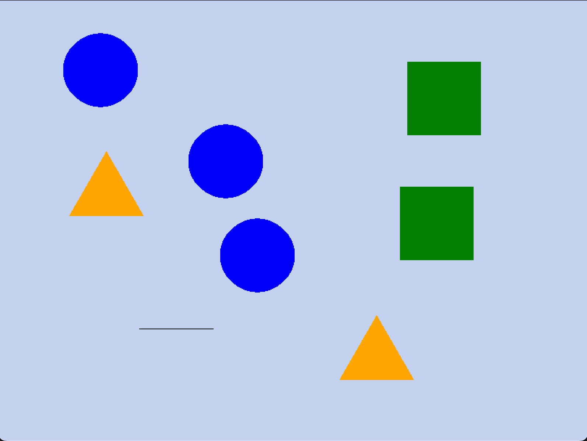

# ShapeDrawer #
This repository contains a shape drawing program created for my first year university unit 'Object-Oriented Programming'

## Features
- Ability to draw several different shapes (Circle, Rectangle, Line, Triangle)
- Save and load a drawing via txt file
  
### Controls
- C, R, L, T to change shape (Circle, Rectangle, Line, Triangle)
- Right click to select a shape
- DEL Key to delete selected shapes
- - S Key to save drawing, O key to load
- SPACE to change canvas colour (random color)

### Installation
To run this program you need .NET and Splashkit
1. git clone https://github.com/minvoker/ShapeDrawer-OOP
2. Open the project in visual studio
3. Run the program
